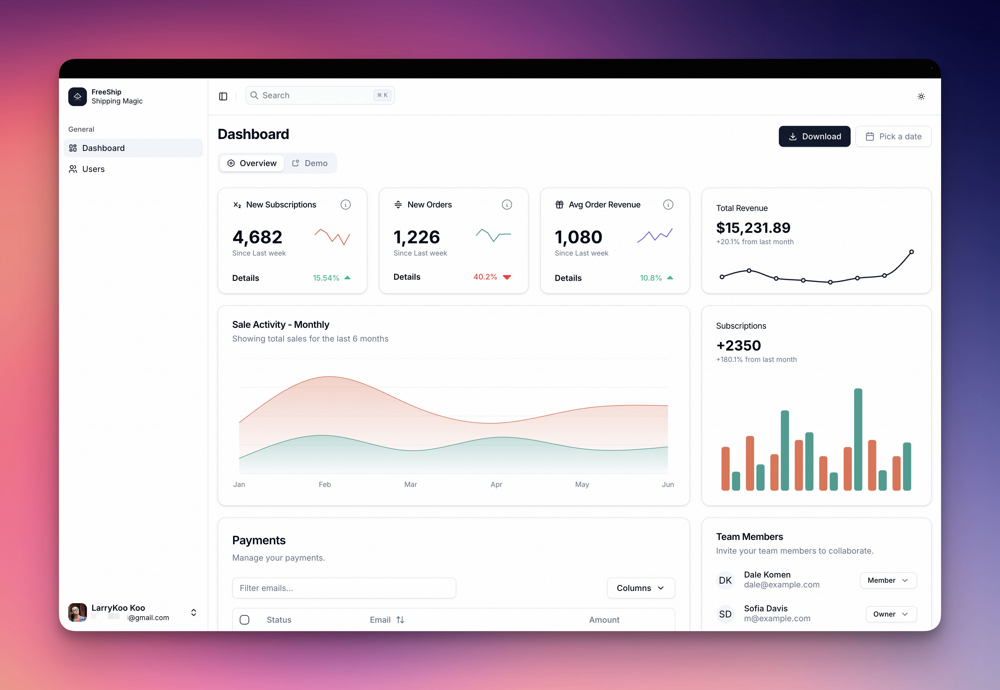

# 🚢 FreeShip - Next.js Starter Template

[](https://nextjs.org/)
[](https://react.dev/)
[](https://www.typescriptlang.org/)
[](https://tailwindcss.com/)
[](./LICENSE)

一个功能齐全、开箱即用的 Next.js 15 现代化项目模板,集成了最新的技术栈和最佳实践。专为快速启动 SaaS、Dashboard 或企业级应用而设计。

[English](./README.en.md) | 简体中文

<div align="center">
  
</div>

<br />

## ✨ 特性

### 🎨 现代化 UI 系统
- ⚡️ **shadcn/ui** - 精美的可定制组件库
- 🎨 **TailwindCSS v4** - 最新版本,性能更强
- 🌓 **深色模式** - 内置主题切换支持
- 📱 **响应式设计** - 完美适配所有设备

### 🚀 最新技术栈
- ⚛️ **Next.js 15.5** - App Router + Server Components
- ⚛️ **React 19** - 最新特性支持
- 📘 **TypeScript 5.9** - 完整类型支持
- 🔐 **Clerk** - 企业级身份验证

### 🛠 开发体验
- 💨 **极快的开发体验** - 热更新 + Turbopack
- 📏 **代码规范** - ESLint v9 + Prettier
- 🎯 **类型安全** - 严格的 TypeScript 配置
- 🎨 **图标系统** - Origami Wave 设计理念

### 📦 开箱即用的功能
- 🎛 **完整的 Dashboard 布局** - 侧边栏 + 面包屑导航
- 📊 **数据表格** - TanStack Table 集成
- 📋 **表单处理** - React Hook Form + Zod
- 🍞 **Toast 通知** - 优雅的消息提示
- 🔍 **命令面板** - 快捷搜索功能

## 🎯 适用场景

- 🏢 **SaaS 应用** - 完整的用户认证 + Dashboard
- 📊 **数据管理平台** - 强大的表格和表单组件
- 🚚 **物流管理系统** - 示例场景已集成
- 💼 **企业后台** - 现代化的管理界面
- 🎨 **快速原型** - 丰富的 UI 组件库

## 🚀 快速开始

### 前置要求

- Node.js 18.0 或更高版本
- pnpm 8.0 或更高版本

### 安装

```bash
# 克隆项目
git clone https://github.com/larrykoo711/koo-freeship.git

# 进入项目目录
cd koo-freeship

# 安装依赖
pnpm install

# 复制环境变量
cp .env.example .env.local
```

### 配置

编辑 `.env.local` 文件,配置 Clerk 认证:

```env
# Clerk 认证配置
NEXT_PUBLIC_CLERK_PUBLISHABLE_KEY=your_publishable_key
CLERK_SECRET_KEY=your_secret_key

# 认证页面路由
NEXT_PUBLIC_CLERK_SIGN_IN_URL=/sign-in
NEXT_PUBLIC_CLERK_SIGN_UP_URL=/sign-up
```

> 💡 前往 [Clerk Dashboard](https://dashboard.clerk.com/) 获取 API 密钥

### 运行

```bash
# 开发模式
pnpm dev

# 构建生产版本
pnpm build

# 启动生产服务器
pnpm start

# 代码检查
pnpm lint

# 代码格式化
pnpm format
```

访问 [http://localhost:3000](http://localhost:3000) 查看应用

## 📁 项目结构

```
koo-freeship/
├── src/
│   ├── app/                    # Next.js App Router
│   │   ├── (dashboard)/        # Dashboard 布局组
│   │   ├── (errors)/           # 错误页面
│   │   ├── sign-in/            # 登录页
│   │   ├── sign-up/            # 注册页
│   │   ├── layout.tsx          # 根布局
│   │   ├── favicon.ico         # 网站图标
│   │   └── icon.png            # PWA 图标
│   │
│   ├── components/             # React 组件
│   │   ├── ui/                 # shadcn/ui 组件
│   │   ├── layout/             # 布局组件
│   │   └── logo.tsx            # Logo 组件
│   │
│   ├── lib/                    # 工具函数
│   └── hooks/                  # 自定义 Hooks
│
├── public/                     # 静态资源
│   └── logo.svg               # SVG Logo
│
├── generate-icons.js          # 图标生成工具
└── components.json            # shadcn/ui 配置
```

## 🔧 技术栈详情

| 技术 | 版本 | 说明 |
|------|------|------|
| Next.js | 15.5.4 | React 全栈框架 |
| React | 19.2.0 | UI 库 |
| TypeScript | 5.9.3 | 类型系统 |
| TailwindCSS | 4.1.14 | 原子化 CSS |
| shadcn/ui | latest | UI 组件库 |
| Clerk | 6.33.3 | 身份认证 |
| TanStack Table | 8.21.3 | 数据表格 |
| React Hook Form | 7.64.0 | 表单处理 |
| Zod | 4.1.12 | Schema 验证 |
| Lucide Icons | 0.545.0 | 图标库 |

## 📚 核心功能

### 1. 身份认证 (Clerk)

```tsx
import { SignIn, SignUp } from "@clerk/nextjs"

// 内置的登录/注册页面
// 支持多种登录方式: 邮箱、社交账号等
```

### 2. 数据表格 (TanStack Table)

```tsx
import { DataTable } from "@/components/data-table"

// 强大的表格功能
// 排序、筛选、分页、列定制
```

### 3. 表单验证 (React Hook Form + Zod)

```tsx
import { useForm } from "react-hook-form"
import { zodResolver } from "@hookform/resolvers/zod"

// 完整的表单解决方案
// 类型安全 + 实时验证
```

### 4. 主题切换

```tsx
import { ThemeProvider } from "next-themes"

// 一键切换浅色/深色模式
// 自动保存用户偏好
```

## 🎯 最佳实践

项目遵循以下最佳实践:

- ✅ **服务端组件优先** - 减少客户端 JS 体积
- ✅ **TypeScript 严格模式** - 确保类型安全
- ✅ **代码分割** - 按需加载组件
- ✅ **SEO 优化** - 完整的 Metadata 配置
- ✅ **性能优化** - 图片优化 + 字体优化
- ✅ **可访问性** - ARIA 标签 + 键盘导航

## 📖 文档

- [Next.js 文档](https://nextjs.org/docs)
- [shadcn/ui 文档](https://ui.shadcn.com/)
- [TailwindCSS 文档](https://tailwindcss.com/docs)
- [Clerk 文档](https://clerk.com/docs)
- [图标设计说明](./ICON_DESIGN.md)

## 🤝 贡献

欢迎贡献代码、报告问题或提出新功能建议!

1. Fork 本仓库
2. 创建特性分支 (`git checkout -b feature/AmazingFeature`)
3. 提交更改 (`git commit -m 'Add some AmazingFeature'`)
4. 推送到分支 (`git push origin feature/AmazingFeature`)
5. 开启 Pull Request

## 📝 变更日志

查看 [CHANGELOG.md](./CHANGELOG.md) 了解版本更新历史

## 🙏 致谢

- [Next.js](https://nextjs.org/) - 强大的 React 框架
- [shadcn/ui](https://ui.shadcn.com/) - 精美的 UI 组件
- [Clerk](https://clerk.com/) - 优秀的认证解决方案
- [Vercel](https://vercel.com/) - 完美的部署平台

## 👥 加入社群

欢迎加入 FreeShip 开发者社群,一起交流学习、分享经验!

<div align="center">
  
  <p><strong>扫码加入微信交流群</strong></p>
  <p>💬 入群暗号: <code>FreeShip</code></p>
  <p>分享你的项目 · 讨论技术问题 · 获取最新动态</p>
</div>

## 💬 联系方式

- GitHub: [@larrykoo711](https://github.com/larrykoo711)
- Issues: [提交问题](https://github.com/larrykoo711/koo-freeship/issues)
- 微信群: 扫描上方二维码加入

---

**如果这个项目对你有帮助,请给一个 ⭐️ Star 支持一下!**

Made with ❤️ by Larry Koo

---

<sub>本项目采用 Apache License 2.0 开源协议 - 详见 [LICENSE](./LICENSE) 文件</sub>